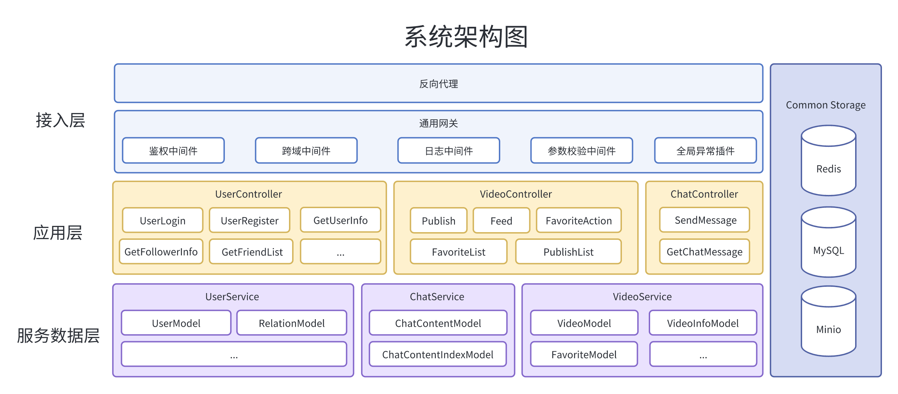
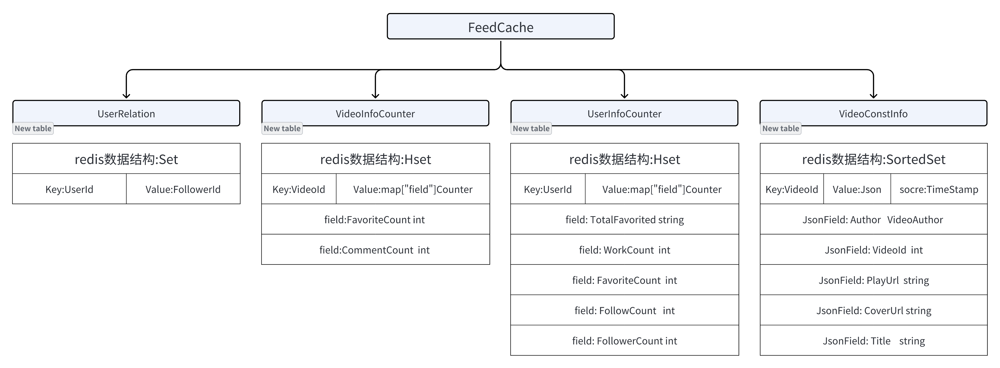
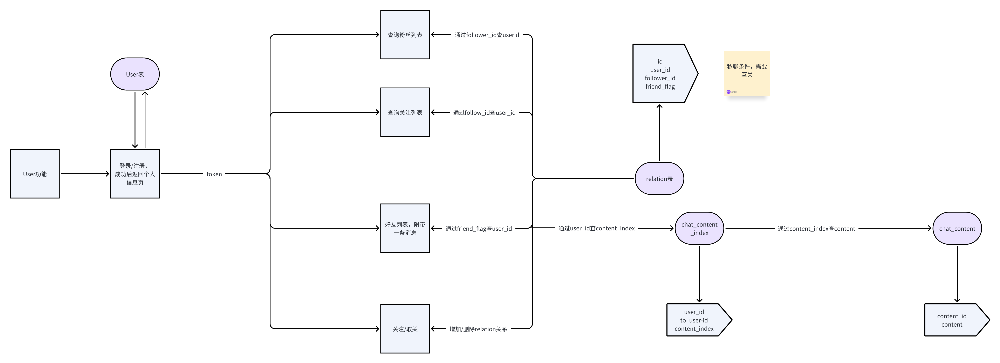
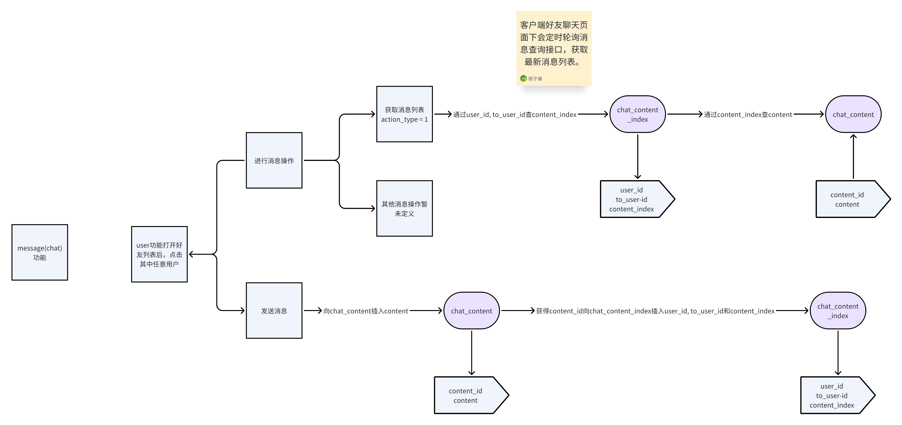
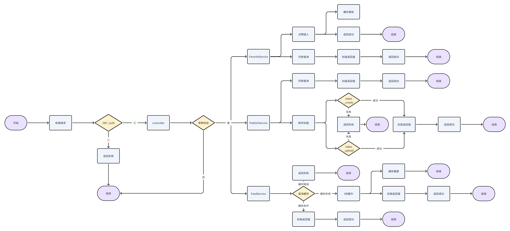
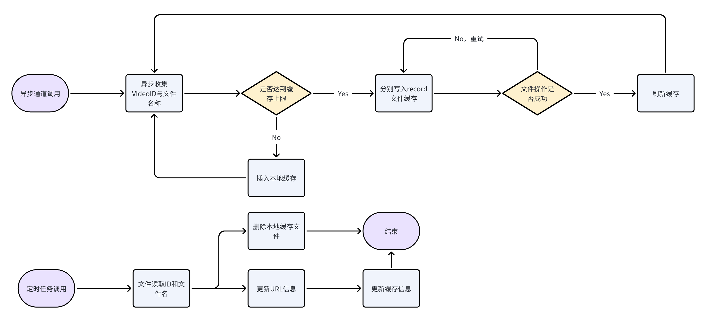

# 抖声后端项目文档

## 目录

- 上手指南
- 文件目录说明
- 整体设计
- 模块设计

## 上手指南

#### 开发配置要求

1. go 1.18+
2. Mysql 5.7+
3. Redis
4. 服务器配置ffempg
5. minio对象存储
6. 抖声客户端

### 安装步骤

1. 安装go [http://www.guoxiaolong.cn/blog/?id=12317](http://www.guoxiaolong.cn/blog/?id=12317)
2. 安装mysql镜像 [https://blog.csdn.net/jingxin_123/article/details/121354104]()
3. 安装Redis镜像 [https://blog.csdn.net/Deikey/article/details/131168148](https://blog.csdn.net/Deikey/article/details/131168148)
4. 安装minio对象存储镜像 [https://blog.csdn.net/m0_43413873/article/details/131572654](https://blog.csdn.net/m0_43413873/article/details/131572654)
5. 服务器配置ffempg [https://zhuanlan.zhihu.com/p/642129856](https://zhuanlan.zhihu.com/p/642129856)

~~~shell
git clone https://github.com/simon12138-code/tiktok.git
~~~

## 文件目录说明

```
.
├── asyncJob #异步任务
├── config #配置解析
├── controller #控制层
├── cronjob #定时任务
├── dao #数据层
├── forms #表单实体
├── global #全局变量与常量
├── initialize #启动项
├── logs #日志
├── middlewares #中间件
├── models #数据实体
├── public #媒体数据缓存
├── redis-db #远端缓存
├── response #返回封装
├── router #路由
├── service #服务层
├── static #静态内容
└── utils #工具类
```

## 整体设计

系统架构图



数据库设计


缓存设计



## 模块设计

用户模块流程图



聊天模块流程图



视频模块流程图



视频模块异步刷新对象存储URL机制

说明：异步任务减缓同步文件写操作冲突与同步调用时延，定时任务解决对象存储url过期问题

